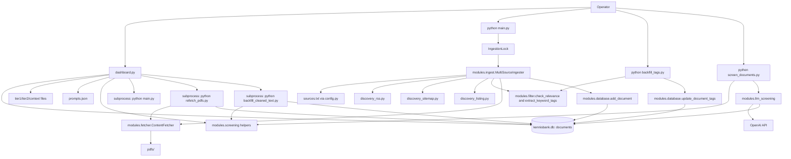

# Project Structure Overview

## What This Repository Is
- A Python-based climate adaptation knowledge base focused on Dutch policy/governance and related evidence sources.
- A batch ingestion pipeline (`main.py`) that discovers from `rss`, `sitemap`, and `listing` sources, filters relevance, extracts content, tags keywords, and stores documents.
- A backend screening runner (`screen_documents.py`) that executes a two-lane OpenAI screening flow (`factual` then `exploratory`) with controlled prompts, curated context selection, normalization/repair, and persisted results.
- A Streamlit operations UI (`dashboard.py`) for browsing docs, filtering (including tags), editing screening prompts/config, reviewing stored screening results, and running non-LLM jobs.
- Local persistence with SQLite (`kennisbank.db`) and local `pdfs/` storage.

## Top-Level Directory Map
```text
KA-database/
|-- modules/
|   |-- __init__.py
|   |-- database.py
|   |-- fetcher.py
|   |-- filter.py
|   |-- ingest.py
|   |-- llm_screening.py
|   |-- screening.py
|   |-- screening_context.py
|   |-- screening_storage.py
|   |-- discovery_rss.py
|   |-- discovery_sitemap.py
|   `-- discovery_listing.py
|-- docs/
|   |-- app_context_for_brainstorming.md
|   |-- feature_log.md
|   |-- llm_screening_plan.md
|   `-- source_onboarding.md
|-- assets/
|   `-- screening_context/
|       |-- core_context.md
|       |-- strategic_lenses.json
|       |-- rvo_footholds.json
|       `-- regression_fixtures.json
|-- pdfs/
|-- main.py
|-- dashboard.py
|-- config.py
|-- refetch_pdfs.py
|-- backfill_tags.py
|-- backfill_cleaned_text.py
|-- screen_documents.py
|-- requirements.txt
|-- tier1_keywords.txt
|-- tier1_keywords_en.txt
|-- tier2_keywords.txt
|-- context_words.txt
|-- context_words_en.txt
|-- sources.txt
|-- feeds.txt
|-- listing_selectors.json
|-- prompts.json
|-- APP_FUNCTIONALITY_AND_GAMEPLAY_LOOP.md
`-- Product_Blueprint.md
```

## Module Responsibilities

| File | Primary Role | Inputs | Outputs | Side Effects |
|---|---|---|---|---|
| `main.py` | Pipeline orchestrator with lock protection | CLI args, config paths, env vars | Pipeline stats + console logs | Creates/removes lock file, runs ingestion |
| `dashboard.py` | Streamlit operator UI | DB records, config files, user actions | UI views and saved settings/analysis | Writes config files, updates DB, runs subprocesses, persists lightweight auth across reload/navigation |
| `config.py` | Central config and file loading/saving | Env vars, text/JSON config files | Source configs, keywords, prompts | Reads/writes prompts; resolves runtime paths |
| `modules/ingest.py` | Multi-source ingestion orchestration | Source configs + discovery candidates | Stored `documents` rows + stats | Calls discovery/fetch/filter/tag/store pipeline |
| `modules/discovery_rss.py` | RSS candidate discovery | RSS source config | Candidate list | HTTP requests + feed parsing |
| `modules/discovery_sitemap.py` | Sitemap candidate discovery | Sitemap source config, include/exclude rules | Candidate list | HTTP/XML parsing, skips broken child sitemaps |
| `modules/discovery_listing.py` | Listing-page candidate discovery | Listing source config + selector templates | Candidate list | HTTP/HTML parsing + pagination |
| `modules/filter.py` | Tiered relevance + keyword tag extraction | Candidate/document text + keyword/context lists | `FilterResult`, keyword tags | No persistent writes |
| `modules/fetcher.py` | URL content retrieval/extraction | URL, source name, title | `FetchResult` (`text`,`type`,`file_path`) | HTTP requests, HTML extraction, PDF downloads, merged article+PDF text for HTML pages with linked PDFs |
| `modules/screening.py` | Deterministic screening preparation + output schemas/normalization | `full_text`, `cleaned_text`, content metadata, keyword tags, prompts | Cleaned text, excerpt payloads, LLM request shapes, response validation/repair helpers | No external API calls; no persistent writes by itself |
| `modules/screening_context.py` | Curated screening context loading + deterministic context selection | Context assets, title, tags, excerpt text | Selected core/lens/foothold subsets + selector diagnostics | Reads local asset files only |
| `modules/screening_storage.py` | Backward-compatible parsing for stored screening JSON | Stored factual/exploratory/context JSON | Normalized dicts for dashboard rendering | No DB writes |
| `modules/llm_screening.py` | Backend OpenAI screening execution | Screenable document row, prompts, selected context, OpenAI config | Validated or normalized factual/exploratory results | HTTP API calls to OpenAI; no direct DB writes |
| `modules/database.py` | SQLAlchemy model/session utilities | `config.DATABASE_PATH`, document payloads | `Document` records + helper queries | Creates/migrates tables; DB reads/writes |
| `refetch_pdfs.py` | Backfill missing PDFs for existing rows | Existing docs without local PDF path | Updated rows | Downloads/stores PDFs; DB updates |
| `backfill_tags.py` | Backfill/recompute keyword tags for existing rows | Existing docs + keyword files | Updated `keyword_tags` values + run stats | DB updates; optional dry-run |
| `backfill_cleaned_text.py` | Backfill deterministic screening text cleanup | Existing docs + stored `full_text` | Updated `cleaned_text` values + run stats | DB updates; optional dry-run |
| `screen_documents.py` | Backend-only screening batch runner | Eligible docs, Step 2 helpers, OpenAI config | Screening run stats | Marks factual and exploratory status, stores input/output/error/context JSON in DB |

## Runtime Data and Persistence
- Database file: `kennisbank.db` (`config.DATABASE_PATH`).
- Core table: `documents` stores:
  - source metadata (`url`, `source_name`, `title`, `publication_date`)
  - discovery metadata (`discovery_method`, `discovery_source_url`)
  - fetched artifacts (`content_type`, `local_file_path`, `full_text`, `fetched_at`)
    - HTML pages with linked PDFs store article text plus appended PDF text in `full_text`, keep `content_type='html'`, and set `local_file_path`.
    - Direct PDF URLs store PDF-only text with `content_type='pdf'`.
  - screening-prep artifacts (`cleaned_text`, `cleaned_text_updated_at`, `cleaned_text_version`)
  - factual screening execution fields (`screening_status`, `screening_requested_at`, `screened_at`, `screening_model`, `screening_input_json`, `screening_output_json`, `screening_error`)
  - screening context/debug fields (`screening_version`, `screening_context_json`)
  - exploratory screening execution fields (`screening_exploratory_status`, `screening_exploratory_requested_at`, `screening_exploratory_screened_at`, `screening_exploratory_model`, `screening_exploratory_input_json`, `screening_exploratory_output_json`, `screening_exploratory_error`)
  - keyword tags (`keyword_tags` JSON array with all matched Tier 1/Tier 2 keywords)
  - processing and legacy AI fields (`processing_status`, `is_relevant`, `ai_summary`, `ai_tasks_json`)
- PDF storage: `<KA_DATA_DIR or BASE_DIR>/pdfs`.
- Ingestion lock file: `<KA_DATA_DIR>/ingestion.lock`.

## Screening Context Model
- Curated runtime assets live under `assets/screening_context/`.
- `core_context.md`
  - always included mission frame for the Opgave Klimaatadaptatie.
- `strategic_lenses.json`
  - curated interpretive questions the selector can rank and pass into the prompts.
- `rvo_footholds.json`
  - practical RVO leverage points the selector can rank and factual/exploratory outputs can reference.
- `regression_fixtures.json`
  - representative examples used for selector regression tests.
- Selector behavior:
  - weighted matching across `title`, `keyword_tags`, and `excerpt_text`
  - no zero-score padding
  - persisted diagnostics include score, matched terms, matched zones, thresholds, and selector misses

## Source Configuration Model
- Canonical file: `sources.txt`
  - format: `method | source_name | url | options_json`
  - methods: `rss`, `sitemap`, `listing`
- Listing selector templates: `listing_selectors.json` (`selector_key` reference from source options).
- Legacy fallback:
  - if `sources.txt` missing, `feeds.txt` is loaded and mapped to `rss` method.

## Freshness and Incremental Rules
- For `sitemap`/`listing`, discovery prefilters by effective min date:
  - `max(6-month cutoff, source latest timestamp in DB)`.
- 6-month cutoff controlled by:
  - `KA_MAX_AGE_DAYS_SITEMAP_LISTING` (default `183`).
- This keeps sitemap/listing incremental and avoids broad historical rescans.

## Execution Entry Points
- Full pipeline: `python main.py`
- Dashboard: `streamlit run dashboard.py`
- PDF backfill: `python refetch_pdfs.py`
- Keyword tag backfill:
  - `python backfill_tags.py --dry-run`
  - `python backfill_tags.py --only-missing`
- Cleaned text backfill:
  - `python backfill_cleaned_text.py --dry-run`
  - `python backfill_cleaned_text.py --only-missing`
- Backend LLM screening:
  - `python screen_documents.py --limit 5`
  - `python screen_documents.py --retry-failed --limit 10`
  - `python screen_documents.py --doc-id 123 --force-rescreen`
  - `python screen_documents.py --dry-run --limit 3`

## Dashboard Authentication
- The dashboard requires login credentials from environment variables:
  - `KA_DASHBOARD_USERNAME`
  - `KA_DASHBOARD_PASSWORD`
- If either variable is missing, dashboard access is blocked (fail closed).
- After login, the dashboard keeps access alive across reloads and card-detail navigation with a lightweight signed query-param token.
- OpenAI screening also requires backend environment variables:
  - `KA_OPENAI_API_KEY`
  - `KA_OPENAI_MODEL`
  - `KA_OPENAI_BASE_URL`
  - `KA_OPENAI_TIMEOUT_SECONDS`
  - `KA_OPENAI_MAX_RETRIES`
  - `KA_SCREENING_BATCH_SIZE`

## Current Screening Flow
- Step 1: deterministic cleanup into `cleaned_text`.
- Step 2: deterministic excerpt selection plus weighted context selection from curated assets.
- Step 3a: factual LLM lane.
  - evidence-first summary, `actor_groups`, `relevance_reasons`, `footholds`, `rvo_link_path`, `score_defense`
  - normalization/repair drops narrow schema mistakes instead of failing the whole lane when possible
- Step 3b: exploratory LLM lane.
  - short strategic memo, optional hypotheses, evidence refs, and `exploration_decision`
  - runtime heuristics can reduce hypothesis count or convert output to `not_needed`
- Dashboard review:
  - reader-first detail screen with summary card, structured actor/relevance blocks, selected lenses/footholds, and expanders for evidence/uncertainties
  - `Advanced` view for metadata, raw payloads, full text, PDFs, and validation warnings

## Architecture Diagram

