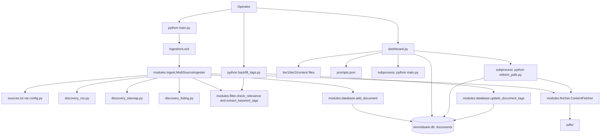

# Project Structure Overview

## What This Repository Is
- A Python-based climate adaptation knowledge base focused on Dutch policy/governance and related evidence sources.
- A batch ingestion pipeline (`main.py`) that discovers from `rss`, `sitemap`, and `listing` sources, filters relevance, extracts content, tags keywords, and stores documents.
- A Streamlit operations UI (`dashboard.py`) for browsing docs, filtering (including tags), editing config, running jobs, and completing manual AI analysis.
- Local persistence with SQLite (`kennisbank.db`) and local `pdfs/` storage.

## Top-Level Directory Map
```text
KA-database/
|-- modules/
|   |-- __init__.py
|   |-- database.py
|   |-- fetcher.py
|   |-- filter.py
|   |-- ingest.py
|   |-- discovery_rss.py
|   |-- discovery_sitemap.py
|   `-- discovery_listing.py
|-- docs/
|   `-- source_onboarding.md
|-- pdfs/
|-- main.py
|-- dashboard.py
|-- config.py
|-- refetch_pdfs.py
|-- backfill_tags.py
|-- requirements.txt
|-- tier1_keywords.txt
|-- tier1_keywords_en.txt
|-- tier2_keywords.txt
|-- context_words.txt
|-- context_words_en.txt
|-- sources.txt
|-- feeds.txt
|-- listing_selectors.json
|-- prompts.json
|-- APP_FUNCTIONALITY_AND_GAMEPLAY_LOOP.md
`-- Product_Blueprint.md
```

## Module Responsibilities

| File | Primary Role | Inputs | Outputs | Side Effects |
|---|---|---|---|---|
| `main.py` | Pipeline orchestrator with lock protection | CLI args, config paths, env vars | Pipeline stats + console logs | Creates/removes lock file, runs ingestion |
| `dashboard.py` | Streamlit operator UI | DB records, config files, user actions | UI views and saved settings/analysis | Writes config files, updates DB, runs subprocesses |
| `config.py` | Central config and file loading/saving | Env vars, text/JSON config files | Source configs, keywords, prompts | Reads/writes prompts; resolves runtime paths |
| `modules/ingest.py` | Multi-source ingestion orchestration | Source configs + discovery candidates | Stored `documents` rows + stats | Calls discovery/fetch/filter/tag/store pipeline |
| `modules/discovery_rss.py` | RSS candidate discovery | RSS source config | Candidate list | HTTP requests + feed parsing |
| `modules/discovery_sitemap.py` | Sitemap candidate discovery | Sitemap source config, include/exclude rules | Candidate list | HTTP/XML parsing, skips broken child sitemaps |
| `modules/discovery_listing.py` | Listing-page candidate discovery | Listing source config + selector templates | Candidate list | HTTP/HTML parsing + pagination |
| `modules/filter.py` | Tiered relevance + keyword tag extraction | Candidate/document text + keyword/context lists | `FilterResult`, keyword tags | No persistent writes |
| `modules/fetcher.py` | URL content retrieval/extraction | URL, source name, title | `FetchResult` (`text`,`type`,`file_path`) | HTTP requests, PDF downloads, text extraction |
| `modules/database.py` | SQLAlchemy model/session utilities | `config.DATABASE_PATH`, document payloads | `Document` records + helper queries | Creates/migrates tables; DB reads/writes |
| `refetch_pdfs.py` | Backfill missing PDFs for existing rows | Existing docs without local PDF path | Updated rows | Downloads/stores PDFs; DB updates |
| `backfill_tags.py` | Backfill/recompute keyword tags for existing rows | Existing docs + keyword files | Updated `keyword_tags` values + run stats | DB updates; optional dry-run |

## Runtime Data and Persistence
- Database file: `kennisbank.db` (`config.DATABASE_PATH`).
- Core table: `documents` stores:
  - source metadata (`url`, `source_name`, `title`, `publication_date`)
  - discovery metadata (`discovery_method`, `discovery_source_url`)
  - fetched artifacts (`content_type`, `local_file_path`, `full_text`, `fetched_at`)
  - keyword tags (`keyword_tags` JSON array with all matched Tier 1/Tier 2 keywords)
  - processing and AI fields (`processing_status`, `is_relevant`, `ai_summary`, `ai_tasks_json`)
- PDF storage: `<KA_DATA_DIR or BASE_DIR>/pdfs`.
- Ingestion lock file: `<KA_DATA_DIR>/ingestion.lock`.

## Source Configuration Model
- Canonical file: `sources.txt`
  - format: `method | source_name | url | options_json`
  - methods: `rss`, `sitemap`, `listing`
- Listing selector templates: `listing_selectors.json` (`selector_key` reference from source options).
- Legacy fallback:
  - if `sources.txt` missing, `feeds.txt` is loaded and mapped to `rss` method.

## Freshness and Incremental Rules
- For `sitemap`/`listing`, discovery prefilters by effective min date:
  - `max(6-month cutoff, source latest timestamp in DB)`.
- 6-month cutoff controlled by:
  - `KA_MAX_AGE_DAYS_SITEMAP_LISTING` (default `183`).
- This keeps sitemap/listing incremental and avoids broad historical rescans.

## Execution Entry Points
- Full pipeline: `python main.py`
- Dashboard: `streamlit run dashboard.py`
- PDF backfill: `python refetch_pdfs.py`
- Keyword tag backfill:
  - `python backfill_tags.py --dry-run`
  - `python backfill_tags.py --only-missing`

## Dashboard Authentication
- The dashboard requires login credentials from environment variables:
  - `KA_DASHBOARD_USERNAME`
  - `KA_DASHBOARD_PASSWORD`
- If either variable is missing, dashboard access is blocked (fail closed).

## Architecture Diagram

